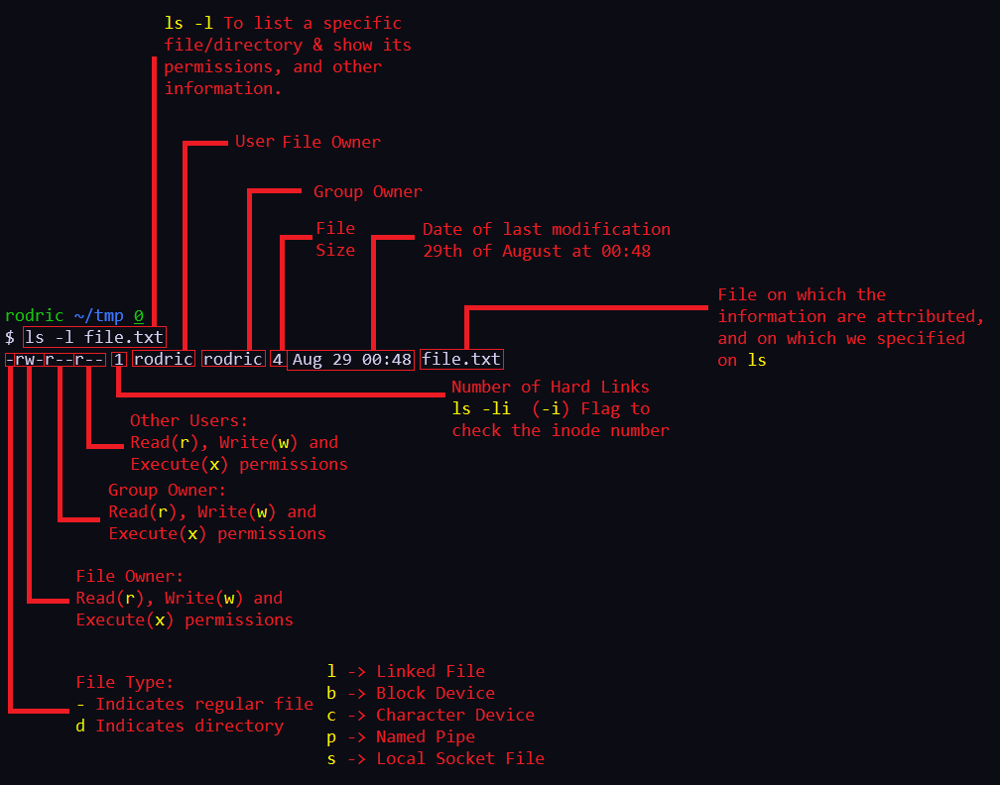
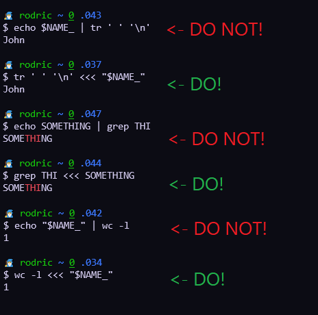

<h2 align="center">Summary</h2>

- [Introduction](#introduction)
	- [Builtin & Keyword](#--builtin--keyword)

- [Bash Commands](#bash-commands)
	- [awk](#--awk)
	- [cat](#--cat)
	- [compgen](#--compgen)
	- [diff](#--diff)
	- [dpkg](#--dpkg)
	- [less](#--less)
	- [ls](#--ls)
- [General](#general-back-to-top)
	- [Control Operators](#--control-operators)
	- [Redirection Operators](#--redirection-operators-no-images-since-output-is-not-shownvisible)
	- [Linked Files: Symbolic Links / Hard Links](#--linked-files--symbolic-links--hard-links-back-to-top)
	- [String Manipulation](#string-manipulation-back-to-top)
		- [Brace Expansion](#--brace-expansion--)
		- [ANSI-C Quoting](#--ansi-c-quoting-)
		- [Arithmetic Expansion](#--arithmetic-expansion-)
		- [Command Substitution & Parameter Expansion](#--command-substitution---parameter-expansion----back-to-top)
- [License](#license)

<!--

<p align="center">
  <a href="#bash-commands">CLI Commands</a> •
  <a href="#--control-operators">Control Operators</a> •
  <a href="#--linked-files--symbolic-links--hard-links">Linked Files</a> •
  <a href="#string-manipulation">String Manipulation</a> •
  <a href="#--redirection-operators-no-images-since-output-is-not-shownvisible">File Manipulation</a>
</p>

-->

<p align="center">
  
</p>

---

<br>

## Introduction
- First of all, what is the meaning of this repository? <br>

In this repository, I'll create a way to simply the learning path to become a Bash Professional, everything I learn, <br>
I see that I think is going to be usefull I add to this repository. If you're not into GNU/Linux Bash, I'll give you <br>
a simple introduction, so that you won't be lost throughout the elapse of this repository.

<br>

- What is **Shell**? <br>

The Shell is a CLI (Command-Line Interface) program that processes and interprets kernel commands and outputs the results to the user. <br>
In the old days, it was the only user interface available on a UNIX-like systems, such as Linux. Nowadays, we have graphical user interfaces (GUIs) in addition to command line interfaces (CLIs) such as the shell.

Shell is a "[REPL](https://en.wikipedia.org/wiki/Read%E2%80%93eval%E2%80%93print_loop)" (Read, Eval, Print and Loop); <br>
Read = Reads the command given by the user <br>
Eval = Executes the command <br>
Print = Returns the results of the given command to the user <br>
Loop = And awaits for another input <br>

If you're really interested in shell history, I'll suggest this repository that shows a [shell ancestry](https://github.com/marcpaq/shellancestry) "tree".

<br>

- What is **Bash**? <br>

Bash is just an application, and its primary job is to run other applications (in the form of commands) that are installed <br>
on the same system. It reads commands from the user input or from a file of commands and executes them, usually by turning <br>
them into one or more system calls. It is usually not part of the kernel since the command interpreter is subject to changes. <br>
If you're really interested, I really recommend reading this whole article: [link](https://questionanswer.io/why-is-command-interpreter-separate-from-kernel/)

Bash is the GNU Project's shell-the Bourne Again SHell (BASH). This is an sh-compatible shell that incorporates useful <br>
features from the Korn shell (ksh) and the C shell (csh). It is intended to conform to the **IEEE POSIX P1003.2/ISO 9945.2 Shell** <br>
and Tools standard. It offers functional improvements over sh for both programming and interactive use. In addition, <br>
most sh scripts can be run by Bash without modification.

<br>

- How to execute a Bash **program**? <br>

To get started, you'll need to create a file using `touch`, `vim file.txt`... etc, using the `.bash` OR the `.sh` file extension. <br>
Although in Linux you don't need to specify the file extension, since Linux automatically identifies if the file is a simple text file, <br>
or if it is a bash/shell script file, we add the `.bash` OR `.sh` extension to the file, to make it more organized and if you're not using <br>
Linux.

Inside of the file you just created, the first thing we add is a **shebang** or a **hashbang**. It takes the form of a comment <br>
(lines starting with `#` are normally ignored by the shell), but the `!` right after the `#` indicates that it has to execute what is <br>
indicated that will process that script, in our case, we put a shebang calling the bash binary (`/bin/bash`), or maybe using a different <br>
method, that can be faster and easier, which I will explain below.

```console
#!/usr/bin/env bash
```
> The above example is running the **env** command with the **bash** parameter. The **env** serves to create a new environment, <br>
and the following parameter is the command that will be executed by the env in this environment. <br>
Since env uses the system path, bash will run without you having to define its exact path, making it faster than the default <br>

> **Important OBS**: From distro to distro, the location of **bash** or **python**, for example, can be different.

<br>

### - Builtin & Keyword

- Builtin: [about](https://www.gnu.org/software/bash/manual/html_node/Bourne-Shell-Builtins.html) <br>
It is a command that has been implemented inside the shell for essential needs of the shell (`cd`, `pwd`, `eval`), or speed in general or to avoid conflicting interpretations of external utilities in some cases. <br>
Below are the list of builtins. (Or just execute `compgen -b` to show all builtins)

> **compgen** is a shell builtin. It displays possible completions depending on the options. <br>
> Intended to be used from within a shell function generating possible completions. <br>
> If the optional WORD argument is supplied, matches against WORD are generated. <br>

<details>
<summary>Expand view all builtins</summary>

```bash
.
:
[
alias
bg
bind
break
builtin
caller
cd
command
compgen
complete
compopt
continue
declare
dirs
disown
echo
enable
eval
exec
exit
export
false
fc
fg
getopts
hash
help
history
jobs
kill
let
local
logout
mapfile
popd
printf
pushd
pwd
read
readarray
readonly
return
set
shift
shopt
source
suspend
test
times
trap
true
type
typeset
ulimit
umask
unalias
unset
wait
```

</details>

- Keyword: [about](https://www.gnu.org/software/bash/manual/html_node/Reserved-Word-Index.html) <br>
A keyword is also known as "reserved word". (Execute `LESS=+/"keyword" man bash` for more info) <br>
And **Reserved Words** are words that have a special meaning to the shell. <br>
The following words are recognized as reserved when unquoted and either the first word of a simple command or the third word of a case or for command. (Or just execute `compgen -k` to show all keywords)

<details>
<summary>Expand to view all keywords</summary>

```bash
if
then
else
elif
fi
case
esac
for
select
while
until
do
done
in
function
time
{
}
!
[[
]]
coproc
```

</details>

<br>

## Bash Commands

### - [Awk](https://linux.die.net/man/1/awk)
> `awk` is a pattern scanning and processing language. <br>
> Awk is used as a command as often as it is used as an interpreted script, <br>
> and can be useful to write tiny but effective programs in the bash command line.


> A simple example of the useful usage of an **if statement** using `awk`. <br>


### - [Cat](https://linux.die.net/man/1/cat)
> Wouldn't be a complete repository without mentioning `cat`, the program which concatenates files and print them to the stdout. <br>
> **Cat** is used to simply show the contents of any kind of file. Just like so: <br>
```console
$ cat script.sh
#!/usr/bin/bash

echo -e "Hello, World\n"
echo -e "\nThis is a loop:"
for ((X_ == 1; X_ <= 10; X_ ++)); do
  echo -e "$X_"
done
```

> In this simple example, I'm using the `-n` flag to number all output lines. <br>
```console
$ cat -n script.sh
     1  #!/usr/bin/bash
     2
     3  echo -e "Hello, World\n"
     4  echo -e "\nThis is a loop:"
     5  for ((X_ == 1; X_ <= 10; X_ ++)); do
     6    echo -e "$X_"
     7  done
```

### - [Compgen](https://www.gnu.org/software/bash/manual/html_node/Programmable-Completion-Builtins.html)
> `compgen` is a bash builtin that generates possible completion matches for word according to the options, <br>
> which may be any option accepted by the complete builtin with the exception of -p and -r, and write the matches to the standard output.

```console
$ compgen -c
- Shows a list of all executable programs on your system.
  Using "wc -l" can help you count how many programs you have in total.

------------------------------------------------------------------------------
$ compgen -b
- Shows a list of all builtins

------------------------------------------------------------------------------
$ compgen -v
- Shows a list of all variables defined in the system, counting those that you
  defined manually.

------------------------------------------------------------------------------
$ compgen -a
- Shows a list of all aliases defined in the system, counting those that you
  defined manually.

# Flags: "-abcdefgjksuv"
```
- A fun little example of how it could be useful to you:


### - [Diff](https://linux.die.net/man/1/diff)
> `diff` allows you to compare two files line by line.
```console
$ diff -s file_1.txt file_2.txt
(Checking the difference of two given files)

- The flag "-s" OR "--report-identical-files", reports when two files are the same.

-------------------------------------------------------------------------------
Ex:
$ cat file_1.txt file_2.txt
Test
Change-me

Test
Changed-you
Added another line

$ diff -s file_1.txt file_2.txt
2c2,3
< Change-me
---
> Changed-you
> Added another line

- 2c(2 changes) 2,3(Line 2 and 3)

-------------------------------------------------------------------------------
- Another cool example, is using the -N, -a, -u and -r flags.
  Which shows a more simple way of understanding the differencies between
  the files, avoidinging incompatibilities and giving more information about them.

$ diff -Naur file_1.txt file_2.txt
--- file_1.txt  2022-11-07 14:34:03.870977100 -0300
+++ file_2.txt  2022-11-07 14:34:27.607286200 -0300
@@ -1,2 +1,3 @@
 Teste
-Change-me
+Changed-you
+Added another line
```

### - [Dpkg](https://linux.die.net/man/1/dpkg)
> `dpkg` is a package manager for Debian, or Debian based distributions.

### - [Dpkg-reconfigure](https://manpages.ubuntu.com/manpages/bionic/man8/dpkg-reconfigure.8.html)
> `dpkg-reconfigure` is a command line tool used to reconfigure an already installed package. <br>
> In this example, I'll show how you can change your bash font using this command.
```console
$ sudo apt install fontconfig
- The command above, will install "fc", which allows us to check/list all of the fonts installed on our system,
  by russing: "fc-list".

------------------------------------------------------------------------------
$ sudo apt install xfonts-terminus # Instalar a fonte Terminus
- Installing the font "Terminus", from xfonts, which is the largest collection of fonts.

------------------------------------------------------------------------------
$ sudo dpkg-reconfigure -plow console-setup # Selecionar a fonte Terminus
- Using dpkg-reconfigure followed by the option flag "-plow".
  "-plow" flag shows all questions, irrespective of whatever default might have been set elsewhere.
- 1- Select the encoding type
  2- The character set to support (Latin1 is recommended)
  3- Select the font name. In this example, you'd have to select "Terminus" font.
  4- And finally, the desired font size.

------------------------------------------------------------------------------
$ cat /etc/default/console-setup
- And to check if everything is as expected, we can cat console-setup
  and look for "FONTFACE", with the name of our font inside quotes.
```

### - [Less](https://linux.die.net/man/1/less)
> `less` allows you to view (**but not change**) the contents of a text file one screen at a time.
```console
$ less file_2.txt
(Showing contents of file_2.txt)

- Press "q" to exit less
- Use "g" to get to the first line of the file
- Use "SHIFT G" to get to the last line of the file

------------------------------------------------------------------------------
$ less -N file_1.txt
(Showing contents of file_1.txt with line count
on the left side of the screen)

-------------------------------------------------------------------------------
$ less file_*.txt

- Less can open multiple files at once, and you can
  navigate through them using: ":p" (Previous) and
  ":n" (Next)

```

### - [Ls](https://linux.die.net/man/1/ls)
> `ls` is used to list file or directory contents.



<br>

---

<br>

## General [(Back to Top)](#summary)

### - File Permissions


- As seen from the `ls` command explanation

```txt
-------------------------------
File permissions are 12 bits

              User  Group  All
0 0 0         110    110   100
| | V sticky  VVV    VVV   VVV
| V setgid    rwx    rwx   rwx
V setuid

For the r/w/x bits:
1 means "allowed" in binary
0 means "not allowed"

-------------------------------

110 in binary is 6

So rw- r-- r--
=  110 100 100
=   6   4   4

chmod 644 file.txt means change
the permissions to: rw- r-- r--
-------------------------------
```

### - Control Operators
> A token that performs a control function. <br>
> It is a "newline" or one of the following: `||`, `&&`, `&`, `;`, `;;`, `;&`, `;;&`, `|`, `|&`, `(`, or `)`. (POSIX Definition) <br>

> A `!` is not a control operator but a [Reserved Word](https://pubs.opengroup.org/onlinepubs/9699919799/utilities/V3_chap02.html#tag_18_04). It becomes a logical NOT [negation operator] inside Arithmetic Expressions and inside test constructs (while still requiring an space delimiter). <br>

#### 1.1 : List terminator <br>
- `;` : Will run one command after another has finished, irrespective of the outcome of the first. (List terminator)


> Here, I execute the `ping` command on a non-existent domain. <br>
> Even though the first command token failed(ping), the second command token will still be executed. <br>

- `&` : This will run a command in the background, allowing you to continue working in the same shell.


> Here, `ping` is launched in the background and `echo` starts running in the foreground immediately, without waiting for `ping` to exit. <br>

#### 1.2 : Logical operators <br>
- `&&` : Used to build **AND** lists, it allows you to run one command only if another exited successfully. <br>


> Here, `echo` will run after `ping` has finished and only if `ping` was successful. (if its exit code was 0) <br>
> Both commands are run in the foreground. <br>
> Exit Code: The value returned by a command to its caller. The value is restricted to eight bits, so the maximum value is 255.

> This command can also be written like so: `if command1; then command2; fi`. (if the return status is ignored)

- `||` : Used to build **OR** lists, it allows you to run one command only if another exited unsuccessfully. <br>


> Here, `echo` will only run if `listtt`(which is a unknown command) failed. (if it returns an exit status other than 0). <br>
> Both commands are run in the foreground. <br>

> This command can also be written like so: `if ! command1; then command2; fi`

- `!` : This is a reserved word which acts as the "**not**" operator (but must have a delimiter), used to negate the return status of a command — return 0 if the command returns a nonzero status, return 1 if it returns the status 0. Also a logical NOT for the test utility. <br>

```bash
! command1

[ ! a = a ]
```

#### 1.3 Pipe operator
- `|` : The pipe operator, passes the output of one command as input to another. A command built from the pipe operator is called a pipeline. <br>


> The pipe (as well as the Command Substitution) creates a **SubShell** to execute the commands, so use it only when it's really necessary. <br>
> When you create a SubShell, you are going to export the entire environment of your current shell to the subshell you are creating, <br>
> so it consumes a lot of time when used. However, most importantly, **anything done in a subshell is lost when the process terminates**. <br>
> When the child shell dies, it can't send back to the parent shell what you created in it. <br>

> Any output printed by `ls` is passed as input to `wc` (which will count words).

- `|&` : This is a shorthand for `2>&1` | in bash and zsh. It passes both standard output and standard error of one command as input to another.

```bash
command1 |& command2
```

#### 1.4 Other list punctuation
- `;;` : Used solely to mark the end of a case statement. Ksh, bash and zsh also support ;& to fall through to the next case and ;;& (not in ATT ksh) to go on and test subsequent cases.

- `(` and `)` are used to group commands and launch them in a subshell.
- `{` and `}` also group commands, but does not launch them in a subshell.

### - Redirection Operators (No images, since output is not shown/visible)
> In the shell command language, a token that performs a redirection function, is one of the following symbols: `<`, `>`, `>|`, `<<`, `>>`, `<&`, `>&`, `<<-`, `<>`.
> These allow you to control the input and output of your commands. They can appear anywhere within a simple command or may follow a command. <br>
> Redirections are processed in the order they appear, from left to right. <br>

> Redirection is a feature in Linux such that when executing a command, you can change the [standard input/output](https://www.gnu.org/software/gnuastro/manual/html_node/Input-output-options.html) devices.


> Where every process receives three **File Descriptors**(FD) by default:
- stdin (0) - Exit Code refers to the **Standard Input** (data inserted to the program/process)
- stdout (1) - Exit Code refers to the **Standard Output** (data printed/outputed by the program/process)
- stderr (2) - Exit Code refers to the **Standard Error** (**from 2 - 255**, stands for messages of error outputed by a program/process)

> Here's a cool example of how file descriptors work: <br>


<br>

- `<` : Gives input to a command.
```bash
command < file.txt
```

> Instead of using `cat` to show the contents of a file and throw it's output to `wc -l` <br>
> we use `<` to give input to a command. Just like so:


> And here's a performance difference between these two cases:


> Execute command on the contents of file.txt

- `<>` : Same as above, but the file is open in **read+write** mode instead of **read-only**.

```bash
command <> file.txt
```

> If the `file.txt` doesn't exist, it will be created. That operator is rarely used because commands generally only read from their stdin.

- `>` : Directs the output of a command into a file.
```bash
command > out.txt
```

> Save the output of command as `out.txt`. If the file exists, its contents will be overwritten and if it doesn't exists, it will be created.
> This operator is also often used to choose whether something should be printed to standard error or standard output. Like so:
```bash
command >out.txt 2>error.txt
```

> `>` will redirect standard output and `2>` redirects standard error.
> Output can also be redirected using `1>` but, since this is the default, the "1" is usually omitted and it's written simply as `>`

> Concluding: to run `command` on `file.txt` and save its output in `out.txt` and any error messages in `error.txt` you would run:
```bash
command < file.txt > out.txt 2> error.txt
```

- `>|` : Does the same as `>`, but will overwrite the target, even if the shell has been configured to refuse overwriting. (with `set -C` OR `set -o noclobber`)
```bash
command >| out.txt
```

> If `out.txt` exists, the output of `command` will replace its content. If it does not exist it will be created.

- `>>` : Does the same as `>`, except that if the target file exists, the new data are **appended**.
```bash
command >> out.txt
```

- `>&` : (per POSIX spec) when surrounded by **digits** (`1>&2`) or `-` on the right side (`1>&-`) either redirects only one file descriptor or closes it (`>&-`).

> A `>&` followed by a file descriptor number is a portable way to redirect a file descriptor, and `>&-` is a portable way to close a file descriptor.


#### All the characters we saw receive/send data from/to files, but in addition to these, we also have: <br>

- `<<<` - Here Strings : Replaces the `echo SOMETHING | CMD` to `CMD <<< SOMETHING`. And by the way, that's exactly why **Here Strings** were created, they have more performance than using it with pipe (`|`).



> The **Here strings** (<<<) was created to avoid this type of construction that was very necessary. The problem is that the command after the pipe (`|`) is executed in a subshell and this fork, in addition to being slower, at the end destroys the entire environment created/modified by it.
> Here's an example of it.


- `<<[-]` - Here Documents : Uses a form of I/O redirection to feed a command list to an interactive program or a command, such as **ftp**, **cat**, or the **ex** text editor. It is also a special-purpose code block.

<!--
https://unix.stackexchange.com/questions/159513/what-are-the-shells-control-and-redirection-operators
-->

<br>

---

<br>

### - Linked Files / Symbolic Links && Hard Links [(Back to Top)](#summary)
> Symbolic links - like shortcuts in **Windows**, and aliases in **MacOS** - provide mechanism for referring to another file. <br>
> Symbolic links can be easily identified by using `ls -l`, and by using the `file` command. <br>

<br>

- Before we go any futher, we first need to understand what an `inode` is. [Full Explanation](https://www.slashroot.in/inode-and-its-structure-linux) <br>

> In general, an **inode**(index node) is an identification in the disk for every file and directory in the filesystem. <br>
> Whenever a user or a program needs access to a file, the operating system first searches for the exact and unique inode (inode number), <br>
> in a table called as an inode table. <br>
> Inodes do not store actual data. Instead, they store the metadata where you can find the storage blocks of each file’s data <br>
> and the metadata that contains in an inode are: <br>

- Mode: <br>
This keeps information about two things, one is the permission information, the other is the type of inode. <br>
For example, an inode can be of a file, directory or a block device etc. <br>

- Owner Info: <br>
Access details like owner of the file, group of the file etc. <br>

- Size: <br>
This location store the size of the file in terms of bytes. <br>

- Time Stamps: <br>
It stores the inode creation time, modification time, etc. <br>

> Now comes the important thing to understand about how a file is saved in a partition with the help of an inode.

- Block Size: <br>
Whenever a partition is formatted with a file system. It normally gets formatted with a default block size. <br>
Block size is the size of chunks in which data will be spread. So, if the block size is 4K, then for a file <br>
of 15K it will take 4 blocks(because 4K\*4 16), and so we waste 1K. <br>

<br>

> Hard Links - are additional pointers to an inode(inode and directory structures work together to provide an underpinning framework that stores all the metadata for every file and directory. filesystem ext4, ntfs... etc), meaning they can exist only on the same volume as the target. <br>
> Executing `ls -i` will tell you what inode you have for a determined file.


> When we use `ln` without any flags, he creates a hard link, that points to inode of a file. Therefore, he gets access to the "real" location of the file. <br> 
> If we deleted **teste2**, which was the first file created, he would still function as normal, since he's pointin to an inode and not the the file itself. <br>


> In this example, it would be using the symbolic link. See that when you create the symbolic link, it doesn't show the original data of the file, and it still has an `l` before the permissions, showing that it's a symbolic link. <br>
> The inode of the two are different, since I referred that file, to the destination file, and not to its inode. <br>
> Finally, on the last line, it shows what happens when the file is deleted. It will simply "kill" the link. If I do a `cat`(command) on the link, it will say that the file was not found/does not exist, since the link reference is to the file, not to the inode.


```console
$ ls -l /usr/bin/awk
("-l" directing ls to use long listing format)

lrwxrwxrwx 1 root root 21 Jun  3  2021 /usr/bin/awk -> /etc/alternatives/awk
                                                    ^^
- The arrow means that /usr/bin/awk is not a regular file, instead
  it is a symbolic link, that points to another file.
- In this case, /usr/bin/awk points to /etc/alternatives/awk

-------------------------------------------------------------------------------
$ file /usr/bin/awk
/usr/bin/awk: symbolic link to /etc/alternatives/awk
(Determine the type of a file using the commando "file")

-------------------------------------------------------------------------------
$ file /etc/alternatives/awk
/etc/alternatives/awk: symbolic link to /usr/bin/gawk

- A symbolic link to /usr/bin/gawk, which is an ELF executable file

$ file /usr/bin/gawk
/usr/bin/gawk: ELF 64-bit LSB shared object, x86-64, version 1 (SYSV),
dynamically linked, interpreter /lib64/ld-linux-x86-64.so.2,
BuildID[sha1]=b863ebf57d3cc33d8e7fed3be0e0b5d235489b46, for GNU/Linux 3.2.0

-------------------------------------------------------------------------------
$ readlink -m /usr/bin/awk
(Reading symbolic link of /usr/bin/awk)

- The flag "-m" follows every symlink(symbolical link) in every component,
  without requirements on components existance.
```

<br>

---

<br>

## String Manipulation [(Back to Top)](#summary)

### - Brace Expansion `{ }`
- **Ex**: preamble{expansion}postscript

> **OBS**: Brace Expansion does not starts with a `$`, only when we're dealing with **Parameter Expansion**. <br>

> The pattern takes the form of an unchanging `preamble`, followed by a variable `expansion` component, followed by an unchanging `postscript`. <br>
> The varying part of the pattern is enclosed by a pair of curly braces. <br>
> The constant part before the opening brace is called `preamble`, and the constant part trailing <br>
> after the closing brace is a `postscript`. <br>
```console
$ echo Street-{Rio_Novo,Vila_Bela,Benedito}-Brazil
Street-Rio_Novo-Brazil Street-Vila_Bela-Brazil Street-Benedito-Brazil

- This pattern has been expanded into three(3) different text strings.
- Each string has the same preamble at the begining, and the same post
  script at the end. The middle part of the string varies, and is
  present in the same order specified in the pattern.

-------------------------------------------------------------------------------
$ echo Street-{Rio_Novo,Vila_Bela,Benedito}
Street-Rio_Novo Street-Vila_Bela Street-Benedito

- Both the preamble and postscript are optional.
- Here, we expand a pattern with a preamble, but with no postscript

-------------------------------------------------------------------------------
$ echo {Rio_Novo,Vila_Bela,Benedito}-Brazil
Rio_Novo-Brazil Vila_Bela-Brazil Benedito-Brazil

- Here, we expand a pattern with a postscript, but with no preamble

-------------------------------------------------------------------------------
$ echo {Rio_Novo,Vila_Bela,Benedito}
Rio_Novo Vila_Bela Benedito

- Here, we expand a pattern with a no preamble and no postscript
```

```console
$ echo I love {Rio_Novo,Vila_Bela,Benedito}
I love Rio_Novo Vila_Bela Benedito

- In here, bash considers "I love" and "{Rio_Novo,Vila_Bela,Benedito}"
  to be separate tokens.
  A Token is a sequence of characters considered a single unit by the shell. It is either a word or an operator.
- As a result, the brace expansion is performed but "I love" is not
  considered a preamble to the brace expansion.
- If we close "I love" in quotes, bash will sees as two(2) tokens.
  1st- "I love"  2st- "{Rio_Novo,Vila_Bela,Benedito}".
-------------------------------------------------------------------------------

- And so, bash still doesn't consider "I love" being a preamble
  to the brace expansion.
- But we can fix that by placing the quoted string
  immediately adjecent to the brace expansion, like so:

$ echo "I love "{Rio_Novo,Vila_Bela,Benedito}.
I love Rio_Novo. I love Vila_Bela. I love Benedito.
```

<br>

> It can also contain a range of integers or characters using the operator `..`
```console
$ echo Number-{1..5}
Number-1 Number-2 Number-3 Number-4 Number-5

-------------------------------------------------------------------------------
$ echo {a..z}
a b c d e f g h i j k l m n o p q r s t u v w x y z

- We can also use a sequence of characters, with the ".." operator.

-------------------------------------------------------------------------------
$ echo a{A{1,2},B{3,4}}b
aA1b aA2b aB3b aB4b

- In the expansion, the preamble (lowercase a), and the
  postscirpt (lowercase b), are constant.
- In the variable part of the expresion,
  the brace expression is a list of items separated by comma
  "A{1,2}" AND "B{3,4}".
- Bash starts with the first item ("A{1,2}"), and this is a brace expansion as well,
  which expands to two(2) strings. Uppercase A1 and uppercase A2.
  
-------------------------------------------------------------------------------
$ echo {1..5}{0,5}%
10% 15% 20% 25% 30% 35% 40% 45% 50% 55%

- List of percentages that are going up by 5, we use one brace expansion
  as a prefix to another. And we also have "%" sign as a suffix.
OR (in bash 4 >)

$ echo {10..55..5}%
10% 15% 20% 25% 30% 35% 40% 45% 50% 55%

- From 10 to 55, skipping 5. More simple!
```

<br>

> Practical example:
```console
$ mkdir {2008..2017}-{01..12}

- With this single command, we are abble to create a list of directories for
  all of the months over a range of 10 years!
```

- Cool Brace Expansion example:
```console
$ man man
- Checking the manual for manual

$ man{,}
- Checking the manual for manual, if you have an empty element in your Brace Expansion,
  it doesn't add anything, but it adds a new word anyway.
```

### - ANSI-C Quoting `$''`
> Causes escape sequences to be interpreted. <br>
> Using `$` as a prefix tells Bash to try to find a variable with that name. <br>
> `$'` is a special syntax (fully explained [here](https://www.gnu.org/software/bash/manual/html_node/ANSI_002dC-Quoting.html#ANSI_002dC-Quoting)) which enables **ANSI-C** string processing. <br>

```console
$ $'\167'
 18:52:39 up  1:26,  0 users,  load average: 0.52, 0.58, 0.59
USER     TTY      FROM             LOGIN@   IDLE   JCPU   PCPU WHAT
- "167" is the UTF-8 octal for the ASCII "w". With backslash-escaped characters
  in string replaced as specified by the ANSI C standard.
  "w" is a command which shows who is logged on and what they are doing.

- I like to imagine ANSI-C Quoting as a medieval version of "echo -e", because...
$ echo -e "\0167"
w

- This time "w" doesn't get interpreted, because it's just a string.
  But to make it executable we can spawn a subshell, just like so:
$ $(echo -e '\0167')
 19:14:56 up  1:48,  0 users,  load average: 0.52, 0.58, 0.59
USER     TTY      FROM             LOGIN@   IDLE   JCPU   PCPU WHAT

-------------------------------------------------------------------------------
- Bonus cool epic example
$ echo 'I'$'\012am'''$'\012''Rodric'$'\041'''
I
am
Rodric!
```

> In this case, the single tick isn't "take value verbatim until the next single tick". It should be quite safe to use. The drawbacks are it's BASH only and quite uncommon, so many people will wonder what it means <br>

### - Arithmetic Expansion `$(())`
> **Arithmetic Expansion** allows the evaluation of an arithmetic expression <br>
> and the substitution of the result. The format for arithmetic expansion is: <br>

```bash
$(( expression ))
```

The expression undergoes the same expansions as if it were within double quotes, but double quote characters in expression are not treated specially and are removed. All tokens in the expression undergo parameter and variable expansion, command substitution, and quote removal. The result is treated as the arithmetic expression to be evaluated. Arithmetic expansions may be nested.

- The evaluation is performed according to the rules listed in [here](https://www.gnu.org/software/bash/manual/html_node/Shell-Arithmetic.html). If the expression is invalid, Bash prints a message indicating failure to the standard error and no substitution occurs.

```console
$ cat parameter.sh
(($# == 0))&& { echo "Usage: ${0##/} parameter(s)" >&2; exit 1;} || { echo "Parameter count: $#";}

$ ./parameter.sh param1 Param2 PARAM3
Parameter count: 3

- Note how it starts counting by the second argument (1) instead of "0".
  Because we're using "$#" that prints the number of arguments, and the argument
  "0" is considered to be the program itself that is being executing.
```

### - Command Substitution `$()` & [Parameter Expansion](https://www.gnu.org/savannah-checkouts/gnu/bash/manual/bash.html#Shell-Parameter-Expansion) `${} $() $(())` [(Back to Top)](#summary)
> Command substitution allows us to use the output of a command as an argument of another command

> The "`$`" character introduces **Parameter Expansion**, **Command Substitution**, or **Arithmetic Expansion**. <br>


> The parameter name or symbol to be expanded may be enclosed in braces, which are optional but serve to protect <br>
the variable to be expanded from characters immediately following it which could be interpreted as part of the name. <br>

> When braces are used, the matching ending brace is the first "`}`" not escaped by a backslash or within a quoted string, <br>
and not within an embedded arithmetic expansion, command substitution, or parameter expansion. <br>

> But there are other characters that also have special significance to bash. <br>
> These include: `$`, `!`, `&`, `\`, ` `(Space, which bash uses to delimit tokens) <br>

- Note: The command substitution is very different from piping. <br>
  Piping, allows us to redirect the output of one command, to the standard input of another. <br>
  The Command Substitution creates a **SubShell** to execute the commands given.
```console
$ echo $(ls /etc/X11)

- Command substitution causes this output to be used as the argument to echo

-------------------------------------------------------------------------------
$ echo Greetings\ \&\ salutations\ {Rodric,Doom}\!
Greetings & salutations Rodric! Greetings & salutations Doom!

- Using space character "\" to escape literal space, since there is not usage
  of quoted string, and so bash considers it as a single token. Also proving
  that the "Greetings & salutations", which are the preamble of the
  brace expansion, still gets interpretated by bash.

```
```console
$ echo ${#USER}
6

(echo environment variable $USER, that prints the current logged user,
and also counting the amount of caracters of this output "#")

- The value for $HOME, $USER, $SHELL, $PATH, $LOGNAME, and $MAIL
  are set according to the appropriate fields in the password entry(login).
  $ man login(1)

-------------------------------------------------------------------------------
$ echo ${USER:0:3}
rod

(echo environment variable $USER, printing the first(0) character to(:)
the forth(3) character)

- Keeping in mind that the first character starts by "0" (0, 1, 2, 3, 4... etc)

```
- [Cool examples of Command Substitution](https://www.gnu.org/software/bash/manual/html_node/Command-Substitution.html)
```console
- Example of a simple program that reads from standard input and counts
  the amount of characters a user puts in.

#!/usr/bin/bash

read -rp "Enter a string: " RESP_

LEN_=$(expr "$RESP_" : '.*')

echo "The length of the input string is: $LEN_"
```

> There are other special characters that retain their special meaning inside double quotes. <br>
> These exceptions includes: `$`, `${}`, `$()`, `$(())`, `\`(When used to escape special characters). <br>

<br>

# License
> This repository is under the MIT License. See [LICENSE](https://github.com/RodricBr/Bash-Professional/blob/main/LICENSE) file for more information.

<!--
# Ideas:
1- https://www.gnu.org/software/bash/manual/html_node/Definitions.html

2- https://www.gnu.org/software/bash/manual/html_node/Bash-Builtins.html
-->
