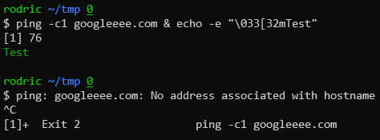

<h2 align="center">Summary</h2>
<p align="center">
  <a href="#bash-commands">CLI Commands</a> •
  <a href="#--control-operators">Control Operators</a> •
  <a href="#--linked-files--symbolic-links--hard-links">Linked Files</a> •
  <a href="#string-manipulation">String Manipulation</a>
</p>

<p align="center">
  
</p>

---

## Bash Commands

### - [Less](https://linux.die.net/man/1/less)
```console
$ less file_2.txt
(Showing contents of file_2.txt)

- Press "q" to exit less
- Use "g" to get to the first line of the file
- Use "SHIFT G" to get to the last line of the file

------------------------------------------------------------------------------
$ less -N file_1.txt
(Showing contents of file_1.txt with line count
on the left side of the screen)

-------------------------------------------------------------------------------
$ less file_*.txt

- Less can open multiple files at once, and you can
  navigate through them using: ":p" (Previous) and
  ":n" (Next)

```

### - [Diff](https://linux.die.net/man/1/diff)
```console
$ diff -s file_1.txt file_2.txt
(Checking the difference of two given files)

- The flag "-s" OR "--report-identical-files", reports when two files are the same.

-------------------------------------------------------------------------------
Ex:
$ cat file_1.txt file_2.txt
Test
Change-me

Test
Changed-you
Added another line

$ diff -s file_1.txt file_2.txt
2c2,3
< Change-me
---
> Changed-you
> Added another line
```

### - [Dpkg-reconfigure](https://manpages.ubuntu.com/manpages/bionic/man8/dpkg-reconfigure.8.html)
> `dpkg-reconfigure` is a command line tool used to reconfigure an already installed package. <br>
> In this example, I'll show how you can change your bash font using this command.
```console
$ sudo apt install fontconfig
- The command above, will install "fc", which allows us to check/list all of the fonts installed on our system,
  by russing: "fc-list".

$ sudo apt install xfonts-terminus # Instalar a fonte Terminus
- Installing the font "Terminus", from xfonts, which is the largest collection of fonts.

$ sudo dpkg-reconfigure -plow console-setup # Selecionar a fonte Terminus
- Using dpkg-reconfigure followed by the option flag "-plow".
  "-plow" flag shows all questions, irrespective of whatever default might have been set elsewhere.
- 1- Select the encoding type
  2- The character set to support (Latin1 is recommended)
  3- Select the font name. In this example, you'd have to select "Terminus" font.
  4- And finally, the desired font size.

$ cat /etc/default/console-setup
- And to check if everything is as expected, we can cat console-setup
  and look for "FONTFACE", with the name of our font inside quotes.
```


<br>

---

<br>

## General

### - Control Operators
> A token that performs a control function. <br>
> It is a "newline" or one of the following: `||`, `&&`, `&`, `;`, `;;`, `;&`, `;;&`, `|`, `|&`, `(`, or `)`. (POSIX Definition) <br>

> A `!` is not a control operator but a [Reserved Word](https://pubs.opengroup.org/onlinepubs/9699919799/utilities/V3_chap02.html#tag_18_04). It becomes a logical NOT [negation operator] inside Arithmetic Expressions and inside test constructs (while still requiring an space delimiter). <br>

#### 1.1 : List terminator <br>
- `;` : Will run one command after another has finished, irrespective of the outcome of the first. (List terminator)


> Here, I execute the `ping` command on a non-existent domain. <br>
> Even though the first command token failed(ping), the second command token will still be executed. <br>

- `&` : This will run a command in the background, allowing you to continue working in the same shell.


> Here, `ping` is launched in the background and `echo` starts running in the foreground immediately, without waiting for `ping` to exit. <br>

#### 1.2 : Logical operators <br>
- `&&` : Used to build **AND** lists, it allows you to run one command only if another exited successfully. <br>


> Here, `echo` will run after `ping` has finished and only if `ping` was successful. (if its exit code was 0) <br>
> Both commands are run in the foreground. <br>
> Exit Code: The value returned by a command to its caller. The value is restricted to eight bits, so the maximum value is 255.

> This command can also be written like so: `if command1; then command2; fi`. (if the return status is ignored)

- `||` : Used to build **OR** lists, it allows you to run one command only if another exited unsuccessfully. <br>


> Here, `echo` will only run if `listtt`(which is a unknown command) failed. (if it returns an exit status other than 0). <br>
> Both commands are run in the foreground. <br>

> This command can also be written like so: `if ! command1; then command2; fi`

- `!` : This is a reserved word which acts as the "**not**" operator (but must have a delimiter), used to negate the return status of a command — return 0 if the command returns a nonzero status, return 1 if it returns the status 0. Also a logical NOT for the test utility. <br>

```bash
! command1

[ ! a = a ]
```

#### 1.3 Pipe operator
- `|` : The pipe operator, passes the output of one command as input to another. A command built from the pipe operator is called a pipeline. <br>


> Any output printed by `ls` is passed as input to `wc` (which will count words).

- `|&` : This is a shorthand for `2>&1` | in bash and zsh. It passes both standard output and standard error of one command as input to another.

```bash
command1 |& command2
```

#### 1.4 Other list punctuation
- `;;` : Used solely to mark the end of a case statement. Ksh, bash and zsh also support ;& to fall through to the next case and ;;& (not in ATT ksh) to go on and test subsequent cases.

- `(` and `)` are used to group commands and launch them in a subshell.
- `{` and `}` also group commands, but does not launch them in a subshell.

### - Redirection Operators
> In the shell command language, a token that performs a redirection function, is one of the following symbols: `<`, `>`, `>|`, `<<`, `>>`, `<&`, `>&`, `<<-`, `<>`.
> These allow you to control the input and output of your commands. They can appear anywhere within a simple command or may follow a command. <br>
> Redirections are processed in the order they appear, from left to right. <br>

- `<` : Gives input to a command.
```bash
command < file.txt
```

> Execute command on the contents of file.txt

- `<>` : Same as above, but the file is open in **read+write** mode instead of **read-only**.

```bash
command <> file.txt
```

> If the `file.txt` doesn't exist, it will be created. That operator is rarely used because commands generally only read from their stdin.

- `>` : Directs the output of a command into a file.
```bash
command > out.txt
```

> Save the output of command as `out.txt`. If the file exists, its contents will be overwritten and if it doesn't exists, it will be created.
> This operator is also often used to choose whether something should be printed to standard error or standard output. Like so:
```bash
command >out.txt 2>error.txt
```

> `>` will redirect standard output and `2>` redirects standard error.
> Output can also be redirected using `1>` but, since this is the default, the "1" is usually omitted and it's written simply as `>`

<!--
https://unix.stackexchange.com/questions/159513/what-are-the-shells-control-and-redirection-operators
-->

<br>

---

<br>

### - Linked Files / Symbolic Links && Hard Links
> Symbolic links - like shortcuts in **Windows**, and aliases in **MacOS** - provide mechanism for referring to another file. <br>
> Symbolic links can be easily identified by using `ls -l`, and by using the `file` command. <br>

> Hard Links - are additional pointers to an inode(inode and directory structures work together to provide an underpinning framework that stores all the metadata for every file and directory. filesystem ext4, ntfs... etc), meaning they can exist only on the same volume as the target. <br>
> Executing `ls -i` will tell you what inode you have for a determined file.


> When we use `ln` without any flags, he creates a hard link, that points to inode of a file. Therefore, he gets access to the "real" location of the file. <br> 
> If we deleted **teste2**, which was the first file created, he would still function as normal, since he's pointin to an inode and not the the file itself. <br>


> In this example, it would be using the symbolic link. See that when you create the symbolic link, it doesn't show the original data of the file, and it still has an `l` before the permissions, showing that it's a symbolic link. <br>
> The inode of the two are different, since I referred that file, to the destination file, and not to its inode. <br>
> Finally, on the last line, it shows what happens when the file is deleted. It will simply "kill" the link. If I do a `cat`(command) on the link, it will say that the file was not found/does not exist, since the link reference is to the file, not to the inode.


```console
$ ls -l /usr/bin/awk
("-l" directing ls to use long listing format)

lrwxrwxrwx 1 root root 21 Jun  3  2021 /usr/bin/awk -> /etc/alternatives/awk
                                                    ^^
- The arrow means that /usr/bin/awk is not a regular file, instead
  it is a symbolic link, that points to another file.
- In this case, /usr/bin/awk points to /etc/alternatives/awk

-------------------------------------------------------------------------------
$ file /usr/bin/awk
/usr/bin/awk: symbolic link to /etc/alternatives/awk
(Determine the type of a file using the commando "file")

-------------------------------------------------------------------------------
$ file /etc/alternatives/awk
/etc/alternatives/awk: symbolic link to /usr/bin/gawk

- A symbolic link to /usr/bin/gawk, which is an ELF executable file

$ file /usr/bin/gawk
/usr/bin/gawk: ELF 64-bit LSB shared object, x86-64, version 1 (SYSV),
dynamically linked, interpreter /lib64/ld-linux-x86-64.so.2,
BuildID[sha1]=b863ebf57d3cc33d8e7fed3be0e0b5d235489b46, for GNU/Linux 3.2.0

-------------------------------------------------------------------------------
$ readlink -m /usr/bin/awk
(Reading symbolic link of /usr/bin/awk)

- The flag "-m" follows every symlink(symbolical link) in every component,
  without requirements on components existance.
```

<br>

---

<br>

## String Manipulation

### - Brace Expansion `{ }`
- **Ex**: preamble{expansion}postscript

> The pattern takes the form of an unchanging `preamble`, followed by a variable `expansion` component, followed by an unchanging `postscript`. <br>
> The varying part of the pattern is enclosed by a pair of curly braces. <br>
> The constant part before the opening brace is called `preamble`, and the constant part trailing <br>
> after the closing brace is a `postscript`. <br>
```console
$ echo Street-{Rio_Novo,Vila_Bela,Benedito}-Brazil
Street-Rio_Novo-Brazil Street-Vila_Bela-Brazil Street-Benedito-Brazil

- This pattern has been expanded into three(3) different text strings.
- Each string has the same preamble at the begining, and the same post
  script at the end. The middle part of the string varies, and is
  present in the same order specified in the pattern.

-------------------------------------------------------------------------------
$ echo Street-{Rio_Novo,Vila_Bela,Benedito}
Street-Rio_Novo Street-Vila_Bela Street-Benedito

- Both the preamble and postscript are optional.
- Here, we expand a pattern with a preamble, but with no postscript

-------------------------------------------------------------------------------
$ echo {Rio_Novo,Vila_Bela,Benedito}-Brazil
Rio_Novo-Brazil Vila_Bela-Brazil Benedito-Brazil

- Here, we expand a pattern with a postscript, but with no preamble

-------------------------------------------------------------------------------
$ echo {Rio_Novo,Vila_Bela,Benedito}
Rio_Novo Vila_Bela Benedito

- Here, we expand a pattern with a no preamble and no postscript
```

```console
$ echo I love {Rio_Novo,Vila_Bela,Benedito}
I love Rio_Novo Vila_Bela Benedito

- In here, bash considers "I love" and "{Rio_Novo,Vila_Bela,Benedito}"
  to be separate tokens.
  A Token is a sequence of characters considered a single unit by the shell. It is either a word or an operator.
- As a result, the brace expansion is performed but "I love" is not
  considered a preamble to the brace expansion.
- If we close "I love" in quotes, bash will sees as two(2) tokens.
  1st- "I love"  2st- "{Rio_Novo,Vila_Bela,Benedito}".
-------------------------------------------------------------------------------

- And so, bash still doesn't consider "I love" being a preamble
  to the brace expansion.
- But we can fix that by placing the quoted string
  immediately adjecent to the brace expansion, like so:

$ echo "I love "{Rio_Novo,Vila_Bela,Benedito}.
I love Rio_Novo. I love Vila_Bela. I love Benedito.
```

<br>

> It can also contain a range of integers or characters using the operator `..`
```console
$ echo Number-{1..5}
Number-1 Number-2 Number-3 Number-4 Number-5

-------------------------------------------------------------------------------
$ echo {a..z}
a b c d e f g h i j k l m n o p q r s t u v w x y z

- We can also use a sequence of characters, with the ".." operator.

-------------------------------------------------------------------------------
$ echo a{A{1,2},B{3,4}}b
aA1b aA2b aB3b aB4b

- In the expansion, the preamble (lowercase a), and the
  postscirpt (lowercase b), are constant.
- In the variable part of the expression,
  the brace expression is a list of items separated by comma
  "A{1,2}" AND "B{3,4}".
- Bash starts with the first item ("A{1,2}"), and this is a brace expanssion as well,
  which expands to two(2) strings. Uppercase A1 and uppercase A2.
```

<br>

> Practical example:
```console
$ mkdir {2008..2017}-{01..12}

- With this single command, we are abble to create a list of directories for
  all of the months over a range of 10 years!
```

### - Command Substitution `$()` & Parameter Expansion `${}`
> Command substitution allows us to use the output of a command as an argument of another command

> The `$` sign is a symbol with special significance to bash. <br>
> But there are other characters that also have special significance to bash. <br>
> These include: `$`, `!`, `&`, `\`, ` `(Space, which bash uses to delimit tokens) <br>

- Note: The command substitution is very different from piping. <br>
  Piping, allows us to redirect the output of one command, to the standard input of another.
```console
$ echo $(ls /etc/X11)

- Command substitution causes this output to be used as the argument to echo

-------------------------------------------------------------------------------
$ echo Greetings\ \&\ salutations\ {Rodric,Doom}\!
Greetings & salutations Rodric! Greetings & salutations Doom!

- Using space character "\" to escape literal space, since there is not usage
  of quoted string, and so bash considers it as a single token. Also proving
  that the "Greetings & salutations", which are the preamble of the
  brace expansion, still gets interpretated by bash.

```
```console
$ echo ${#USER}
6

(echo environment variable $USER, that prints the current logged user,
and also counting the amount of caracters of this output "#")

- The value for $HOME, $USER, $SHELL, $PATH, $LOGNAME, and $MAIL
  are set according to the appropriate fields in the password entry(login).
  $ man login(1)

-------------------------------------------------------------------------------
$ echo ${USER:0:3}
rod

(echo environment variable $USER, printing the first(0) character to(:)
the forth(3) character)

- Keeping in mind that the first character starts by "0" (0, 1, 2, 3, 4... etc)

```
- [Cool examples of Parameter Expansion](https://www.gnu.org/software/bash/manual/html_node/Shell-Parameter-Expansion.html)
```console
- Example of a simple program that reads from standard input and counts
  the amount of characters a user puts in.

#!/usr/bin/bash

read -rp "Enter a string: " RESP_

LEN_=$(expr "$RESP_" : '.*')

echo "The length of the input string is: $LEN_"
```

> There are other special characters that retain their special meaning inside double quotes. <br>
> These exceptions includes: `$`, `${}`, `$()`, `$(())`, `\`(When used to escape special characters). <br>


<br>


<!--
https://www.gnu.org/software/bash/manual/html_node/Definitions.html
-->
